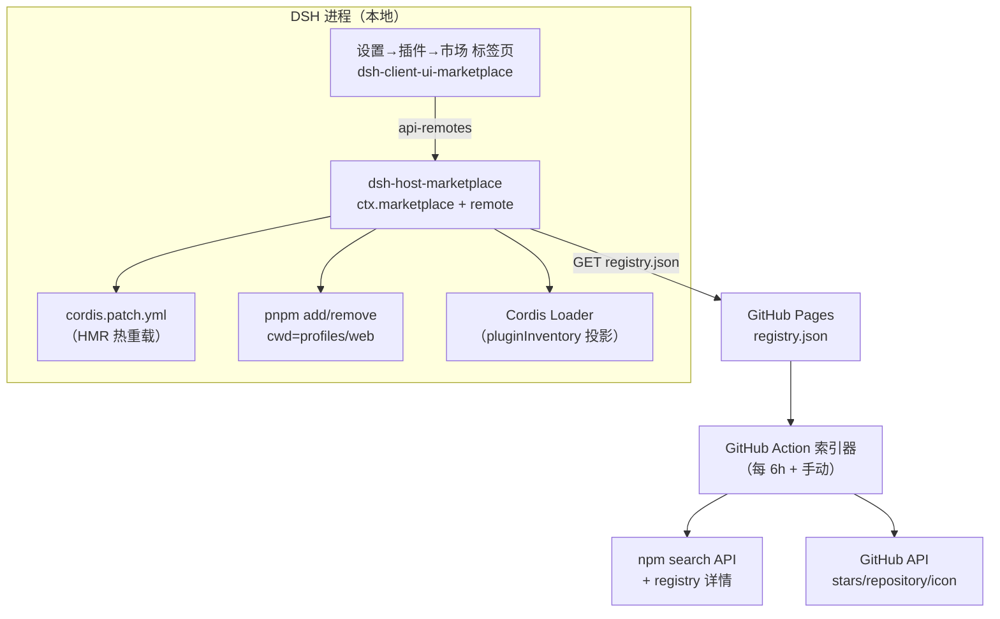
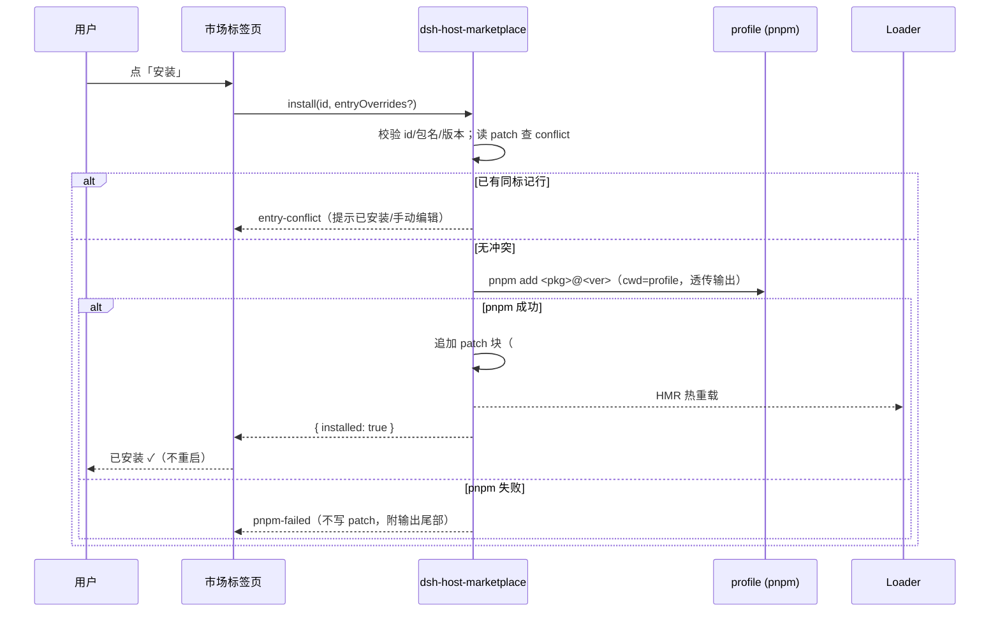

# phase1.1 · DSH 插件市场 MVP（VS Code Marketplace 形态）

> 状态：active ｜ 创建：2026-08-20 ｜ 项目：dsh-plugin-marketplace ｜ 完成后移入 plan-completed

## 1. 当前现状

### 1.1 DSH 插件体系（已源码调研）

- 插件 = npm 包 + `cordis.patch.yml` 插件行（`insert:` 列表），生效于 `$DSH_HOME/profiles/<profile>/`（活动 profile 默认 `web`）
- `cordis.patch.yml` 是用户 patch 层，**HMR 热重载**（写入即生效，无需重启）
- 依赖管理：`dsh plugin --profile <name> <pnpm args>`（pnpm 转发 + 按 `dsh.bundle` 声明 reconcile 层列表）；profile 含 package.json / cordis.patch.yml / pnpm-workspace.yaml
- 已装插件状态：`pluginInventory/list` Remote（Loader 只读投影：entryId/moduleName/enabled/fiberPhase）
- 前端扩展点：`settings.plugins.tab` slot（设置→插件分区标签页栏），Host→Client 走 api-remotes（Typert 生成 + `ctx.remote.$mount()`）
- 官方包：安装目录 `node_modules/@deepseek-ai/` 共 195 个包（dsh-* 系列），含 description/version 元数据；bundle 声明（`dsh.bundle`）的只有 dsh-base / dsh-headless / dsh-web-app

### 1.2 生态现状（已验证）

- npm 上第三方 DSH 插件 **120+** 个（`keywords:dsh-plugin` 命中 121、名称前缀 dsh-* 若干），无统一目录
- 识别信号已验证：keywords（dsh-plugin / deepseek-harness）、包名前缀（dsh-* / dsh-plugin-*）、真实包如 `dsh-chat-import`、`dsh-feishu-bot`、`@tappass/dsh-governance`
- **npm downloads API 对小众包返回 404（已实测），不可作为流行度信号**；GitHub search API 可用（无 token，限流约 10 次/分）→ 流行度用 **GitHub stars**
- 参考对象：VS Code Marketplace（扩展视图/卡片/验证/版本管理形态）、SkillsMP（自动索引 GitHub 生态模式）、Smithery（CLI 一键安装）

## 2. 目标

1. **全量目录**：市场能看到所有 DSH 插件——官方（本地扫描 `@deepseek-ai/dsh-*`）+ 社区（npm 自动索引，发包即入市）
2. **VS Code 风格扩展视图**（内嵌 DSH Web GUI）：搜索、分类筛选、卡片（图标/名称/发布者/描述/星标/verified 徽章/安装状态）、详情（README/版本/entry 预览）、操作（安装/更新/禁用/启用/卸载）
3. **安装管道**：社区插件 = pnpm add + 写 patch 行；官方插件 = 只写 patch 行（本地已有）；全部 HMR 热生效
4. **索引器**：CI 定时扫描 npm → 过滤 → 丰富元数据（GitHub stars/repository/icon）→ `registry.json` → GitHub Pages
5. **安全**：安装前确认弹窗（来源/写操作全展示）、id 与包名校验、幂等 patch 编辑、可回滚

## 3. 顶层设计

### 3.1 总体架构



### 3.2 与 VS Code Marketplace 要素对照

| VS Code 要素 | 本方案实现 |
|---|---|
| 扩展视图（搜索/分类/卡片） | 设置→插件分区「市场」标签页（复用 settings.plugins.tab） |
| 卡片：图标/名称/发布者/描述/评分/下载量 | 图标（npm `icon` 或 GitHub repo 头像）、名称、发布者（npm maintainers）、描述、**GitHub stars**、verified 徽章 |
| 验证发布者 | `@deepseek-ai/*` 官方徽章 + npm `trustedPublisher`（GitHub OIDC 发布）信号 |
| 安装/更新/禁用/卸载 | 安装=pnpm add+patch 行；更新=pnpm update；禁用=移除 patch 行（保留依赖）；卸载=移除行+pnpm remove |
| 扩展版本管理 | npm 版本（registry 记录 latest，安装可指定版本） |
| vsce publish 发布管道 | npm publish + 索引器自动收录（零门槛，无审核步骤） |
| 扩展文件托管 | npm registry（DSH 插件本质是 npm 包） |
| 推荐/精选/评分 | Phase 2/3（无后端，首期不做） |

### 3.3 关键决策（已确认 + 本 plan 定案）

| 决策点 | 定案 | 理由 |
|---|---|---|
| Registry 托管 | GitHub Pages 静态 registry.json | 零成本、可审计；协议不变可平滑迁移 |
| 索引模式 | 自动（CI 定时），不做人工 PR 审核 | 全量目录目标（SkillsMP 模式） |
| 市场范围 | 只做 Cordis npm 插件（preset 二期） | 用户确认 |
| 安装落点 | 活动 profile（默认 web）：package.json + cordis.patch.yml | DSH 既有机制 |
| 流行度信号 | GitHub stars（repos 无则 0） | npm downloads API 实测对小众包 404 |
| entry 默认推导 | id = 包名去掉 scope 与前缀（`@ccchase/dsh-plugin-wechat` → `wechat-bridge` 不可推导时回退 `dsh-plugin-<slug>`），name = 包名，config = {} | 自动索引拿不到插件作者意图的 entry，安装弹窗中用户可改 |
| 官方插件展示 | 本地扫描 @deepseek-ai/dsh-* 全部包，标注类型（bundle/插件/核心库），启用=写 patch 行 | 「能看到所有插件」的另一半 |
| 安装状态判定 | registry id ↔ patch 行标记 + pluginInventory 交集 | 单一事实源：patch 行（用户手写的行也算已安装） |

## 4. 契约定义

### 4.1 registry.json v1（GitHub Pages 根路径提供）

```json
{
  "schemaVersion": 1,
  "updatedAt": "2026-08-20T00:00:00Z",
  "plugins": [
    {
      "id": "dsh-chat-import",
      "origin": "community",
      "name": "dsh-chat-import",
      "summary": "导入 Claude Code / Codex / ChatGPT 会话为 DSH 会话",
      "description": "……（npm description）",
      "author": { "name": "Nwflower", "url": "https://github.com/Nwflower" },
      "license": "MIT",
      "tags": ["import", "conversation"],
      "version": "0.1.1",
      "package": "dsh-chat-import",
      "entry": { "id": "dsh-chat-import", "name": "dsh-chat-import", "config": {} },
      "verified": false,
      "homepage": "https://github.com/Nwflower/dsh-chat-import",
      "repository": "https://github.com/Nwflower/dsh-chat-import",
      "icon": "https://raw.githubusercontent.com/Nwflower/dsh-chat-import/main/icon.png",
      "stars": 12,
      "publishedAt": "2026-01-15T00:00:00Z",
      "updatedAt": "2026-08-01T00:00:00Z"
    }
  ]
}
```

字段约束：
- `id`：`[a-z0-9][a-z0-9-]*`，与 package 一一对应；scope 包用 `<scope>-<name>`（如 `@tappass/dsh-governance` → `tappass-dsh-governance`）
- `entry`：安装时写入 patch 行的模板；`entry.id` 安装时若与已有行冲突则报错（不自动改名）
- `verified`：true 仅限 `@deepseek-ai/*` 官方包
- 官方插件**不进 registry**（由 DSH 本地扫描提供，避免重复与版本漂移）

### 4.2 Host 服务 `ctx.marketplace`（Typert Remote，命名空间 `marketplace`）

| 方法 | 入参 | 出参 | 错误 |
|---|---|---|---|
| `list` | `{ query?, origin?, installed? }` | `{ entries: MarketplaceEntry[], installed: InstalledInfo[], updatedAt }` | `registry-unreachable`（索引拉取失败但可用缓存） |
| `detail` | `{ id }` | `{ entry, readme? }` | `not-found` |
| `install` | `{ id, version?, entryOverrides? }` | `{ id, installed }` | `entry-conflict`（patch 已有同 id 行）／`pnpm-failed`（附输出尾部） |
| `uninstall` | `{ id, removeDeps? }` | `{ id, removed }` | `not-installed` |
| `update` | `{ id, version? }` | `{ id, version }` | `not-installed`／`pnpm-failed` |
| `enable` | `{ id }`（官方插件） | `{ id, enabled }` | `not-found` |
| `disable` | `{ id }` | `{ id, disabled }` | `not-installed` |
| `refresh` | — | `{ updatedAt }` | `registry-unreachable` |

`MarketplaceEntry`：registry 字段 + `local`（官方插件扫描补充：`installed: bool`、`enabled: bool`、`packageKind: bundle|plugin|library`、`localVersion`）。
`InstalledInfo`：patch 行扫描结果 `{ id, package, enabled, source: "marketplace"|"manual" }`。

配置（settings 命名空间 `marketplace`）：`registryUrl`（默认 `https://chasepassion.github.io/dsh-plugin-marketplace/registry.json`）、`profileName`（默认 `web`）。

### 4.3 cordis.patch.yml 编辑协议

- 安装/启用 = 文件末尾追加块：
  ```yaml
  # marketplace: <id>
  - insert:
      - id: <entry.id>
        name: <entry.name>
        config: { }
  ```
- 标记注释 `# marketplace: <id>` 是幂等键：已存在同标记 → 安装报 `entry-conflict`（不覆盖、不重复追加）
- 禁用/卸载 = 按标记删除该块（含标记注释行）；文件原注释与其余内容**逐字保留**（行级编辑，不整文件序列化）
- 回滚：pnpm 失败 → 不写 patch；patch 写失败 → 返回错误并给出已执行的 pnpm 命令，用户可重跑
- 文件不存在则创建（带模板头注释）

### 4.4 官方插件本地扫描

- 扫描目录：安装根 `node_modules/@deepseek-ai/`（npm cache _npx 目录，经 `resolveDshHome`/安装锚点推导）+ `$DSH_HOME/profiles/node_modules` flat fallback
- 每条：name/description/version/packageKind（有 `dsh.bundle` → bundle；否则按导出形态启发式：名称含 `tool-|command-|client-|host-` → plugin；其余 → library，UI 标注「核心库，通常由组合层组装」）
- 已启用判定：patch 行中 `name` 匹配该包名

## 5. 核心流程

### 5.1 安装（社区插件）



### 5.2 索引器（CI 定时）

```mermaid
flowchart LR
    A[npm search<br/>keywords:dsh-plugin] --> B[聚合去重<br/>+ 名称前缀补扫]
    B --> C[过滤噪声<br/>@babel/eslint/官方包]
    C --> D[详情：registry.npmjs.org/<pkg><br/>description/version/license/repo/icon]
    D --> E[GitHub stars<br/>分批限流 10/min + 缓存]
    E --> F[生成 registry.json]
    F --> G[commit + Pages 发布]
```

## 6. 实施路径

### Task 1 · 索引器 `indexer/`（纯 Node，零依赖，node:fetch）

步骤：
1. `indexer/index.mjs`：主流程串行执行 5.2 各步；输出 `registry/registry.json`
2. 搜索：npm search API `?text=keywords:dsh-plugin&size=250` ×2 页 + `text=deepseek-harness&size=250` + 名称前缀补扫（`text=dsh-plugin-`、`text=dsh-` 与已知包并集），全部按 name 去重
3. 过滤：排除 `@babel/*`、`eslint-*`、`@typescript-eslint/*`、`react-native-harness*`、`@deepseek-ai/*`（官方）；排除 description 缺失的；排除 keywords 中无任何 DSH 信号**且**名称不含 dsh 前缀的（保留含 dsh-plugin/dsh- 前缀与含 dsh 信号的包）
4. 详情：`GET https://registry.npmjs.org/<encoded-pkg>/latest`（并行 8，重试 2 次），取 description/license/version/repository/homepage/icon/maintainers/date
5. stars：从 repository 解析 `owner/repo`，`GET api.github.com/repos/<owner>/<repo>`（无 token 限流，串行 + 500ms 间隔 + 失败降级 0），结果缓存 `registry/cache/stars.json`
6. entry 推导：id 见 3.3；summary = description 首句（≤120 字符）；tags 从 keywords 中保留 DSH 语义词（chat/bridge/import/tools/memory/sandbox/…）或空
7. `registry/registry.json` 原子写出（先写 tmp 再 rename）
8. 验证：`node indexer/index.mjs` 手动运行 → 条目数 ≥ 80；抽查 5 条字段完整；JSON 通过 `node -e "JSON.parse(...)"`

### Task 2 · Pages 发布 `.github/workflows/index-and-deploy.yml`

步骤：
1. 重写现有 workflow：schedule（每 6h）+ workflow_dispatch；steps：checkout → setup-node(22) → 运行索引器 → commit registry.json → `actions/configure-pages@v5` + `actions/upload-pages-artifact@v3`（with path=registry） + `actions/deploy-pages@v4`
2. 仓库 Settings → Pages：Source = GitHub Actions
3. 验证：手动触发 workflow → `https://chasepassion.github.io/dsh-plugin-marketplace/registry.json` 200 且字段完整

### Task 3 · `packages/dsh-host-marketplace`（Host 插件）

步骤：
1. 包骨架：package.json（name `@dsh-marketplace/host` 暂定，exports 结构仿 dsh-host-plugin-inventory）+ `src/index.ts`
2. 服务类 `MarketplaceGateway extends TypertRemoteService`：super(ctx, "marketplace")，方法按 4.2 表实现（Remote 装饰器）；Typert 产物 `src/typert.ts` 由生成器产出（无生成器则手写等价 zod schema + invocation 描述，参照 plugin-inventory 的 typert.host.js 结构）
3. `src/registry.ts`：拉取/缓存 registry.json（内存缓存 + `refresh()` 强制；失败用缓存并报 `registry-unreachable`）
4. `src/patch-editor.ts`：行级 append/remove（4.3 协议）+ 冲突检测 + 幂等；单测覆盖：追加、重复安装、卸载保留注释、文件缺失创建
5. `src/pnpm-runner.ts`：spawn（win32 用 `pnpm.cmd`，shell），cwd = `resolveDshHome()/profiles/<profileName>`，超时 120s，收集输出尾部 2000 字符
6. `src/official-scan.ts`：4.4 本地扫描（安装锚点经 `dsh-app-boot` 的 INSTALL_ANCHOR 推导或配置 `installRoot`）
7. `src/index.ts`：plugin 导出（name/inject/apply），注册服务 + settings 命名空间（schema：registryUrl/profileName）+ 注入依赖声明
8. 单元测试（node:test 或 vitest）：patch-editor 全分支、id/包名校验（`../`、绝对路径、非法字符拒绝）、entry 冲突
9. 验证：`pnpm tsc` 通过；测试全绿

### Task 4 · `packages/dsh-client-ui-marketplace`（Client UI）

步骤：
1. 包骨架（仿 dsh-client-ui-settings-plugin-inventory：client.js 单入口 + ModuleLoader 加载形态；开发时用仓库内 tsx 源码 + 构建产物由 DSH 仓库流程管理，本仓库只维护源码与构建脚本）
2. 注册 `settings.plugins.tab` 贡献（label「市场」，order 置于「插件列表」之后）
3. 组件：
   - `MarketplaceTab`：搜索框 + origin 筛选 chips（全部/官方/社区/已安装）+ 状态行（条目数/更新时间/刷新按钮）
   - `PluginCard`：icon/名称/发布者/摘要/stars/verified 徽章/安装状态（已安装/已启用/可更新）→ 点击展开详情
   - `PluginDetail`：README（只读渲染，markdown → 简单分段/代码块转义）、版本、license、repository 链接、entry 预览（JSON 展示 + config 可编辑表单）、操作按钮（安装/更新/禁用/启用/卸载）
   - `InstallConfirmDialog`：展示将写入 patch 的完整 YAML + 将执行的 pnpm 命令 + 来源信息；确认后调 install
4. remote 调用：经 api-remotes 模式 `ctx.remote.marketplace.list()` 等（await + 错误态 + 重试）
5. 文案全部中文（i18n 字典文件），无 unicode 转义
6. 验证：`pnpm tsc`（client tsconfig）+ 构建产物可被 ModuleLoader 加载

### Task 5 · 端到端验证（本机真实 DSH）

步骤：
1. 用 `dsh plugin --profile web add` 等价方式把 host/client 两包装入活动实例（或先以 file: 依赖挂入 profile 验证）
2. 打开设置→插件→市场：确认列表出现 registry 全部条目 + 官方插件（本地扫描）
3. 安装 `dsh-chat-import`：确认弹窗 → 确认 → pnpm 执行 → patch 行追加 → Loader 激活（插件列表可见）→ 无需重启
4. 卸载 → patch 行移除 → Loader 消失；重复安装 → entry-conflict 文案
5. 安装一个不存在的包 id → pnpm-failed 且 patch 未被写
6. 官方插件（如 dsh-tool-fs）启用/禁用 → patch 行增删 → 热生效
7. 手动在 patch 加注释后安装/卸载 → 注释保留
8. 刷新 registry（改 registryUrl 指向测试 JSON）→ list 更新

## 7. 验收标准（全部通过即完成）

- [ ] registry.json 生成 ≥ 80 条社区插件，字段完整、无重复、无官方包混入
- [ ] Pages 可访问 `.../registry.json`，CI 手动触发一次成功
- [ ] Host 包：list/detail/install/uninstall/update/enable/disable/refresh 全部可用；单测覆盖 patch 编辑与校验分支
- [ ] UI：市场标签页可搜索/筛选/详情/安装确认/卸载；中文文案
- [ ] 端到端 8 步全过（含失败路径与注释保留）
- [ ] 仓库 README 更新（安装说明 + 架构图）

## 8. 决策点（实施中定案，均给默认）

| 决策点 | 默认方向 |
|---|---|
| 分类体系 | 首期 tags 直出（不强做 taxonomy）；分类 chips 从数据中聚合 |
| 官方插件库 vs 插件判定 | 启发式（名称前缀）+ UI 标注「核心库」；不做入口探测（成本高收益低） |
| icon | npm `icon` 字段 → 无则 GitHub avatar（repo owner）→ 无则不显示 |
| 更新策略 | 手动更新（list 标记「有更新」= registry.version > 已装版本）；自动更新 Phase 2 |
| 安装版本 | 默认 latest；registry 记录 pinned version 供重复安装幂等 |

## 9. Non-goals（本 phase 不做）

- skill / mcp 市场、动态插件分发、preset 市场（Phase 2）
- 评分/评论/推荐位/独立门户网站（Phase 3，无后端）
- 自动更新、多 profile 并行管理
- 修改部署随附配置（只写 `$DSH_HOME/profiles/<profile>/`）
- 官方 registry 的审核/签名（verified 仅标记）

## 10. 风险与回退

| 风险 | 缓解 |
|---|---|
| npm search 信号漏召/误召 | 多信号并集 + 过滤；registry.json 人工抽查；后续可加 GitHub 仓库级扫描 |
| GitHub API 限流（无 token） | 串行 + 缓存（cache/stars.json 提交入库）；CI 可配 GITHUB_TOKEN 提升额度 |
| pnpm 在 Windows 的 spawn | 用 pnpm.cmd + shell；失败输出尾部透传 |
| patch 行与用户手动编辑冲突 | 幂等标记 + conflict 报错不覆盖；行级编辑保留注释 |
| Host 包不在官方包分发渠道 | 先以 file: 依赖挂入 profile 验证，确认后发布 npm（`@dsh-marketplace/*` 或并入官方） |
